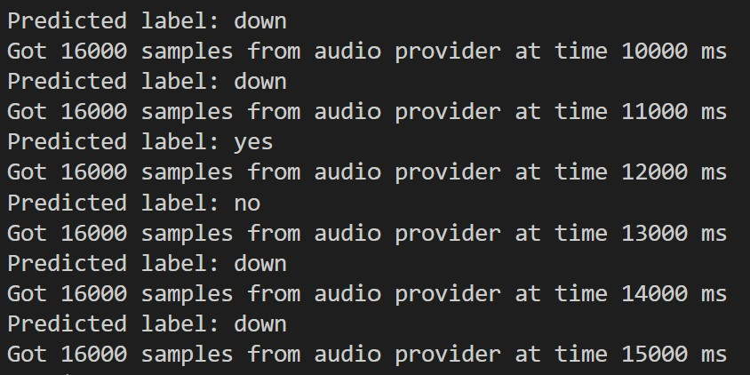
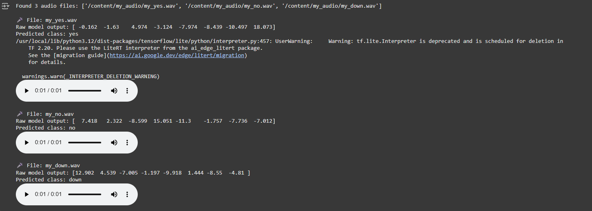
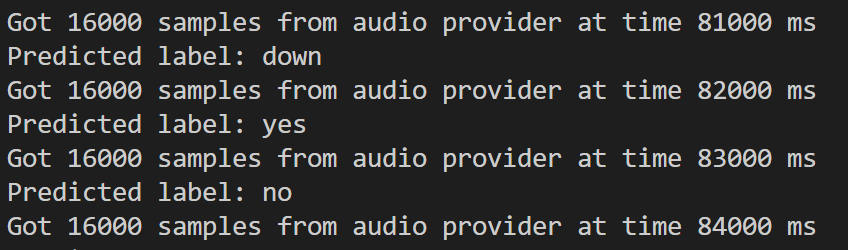
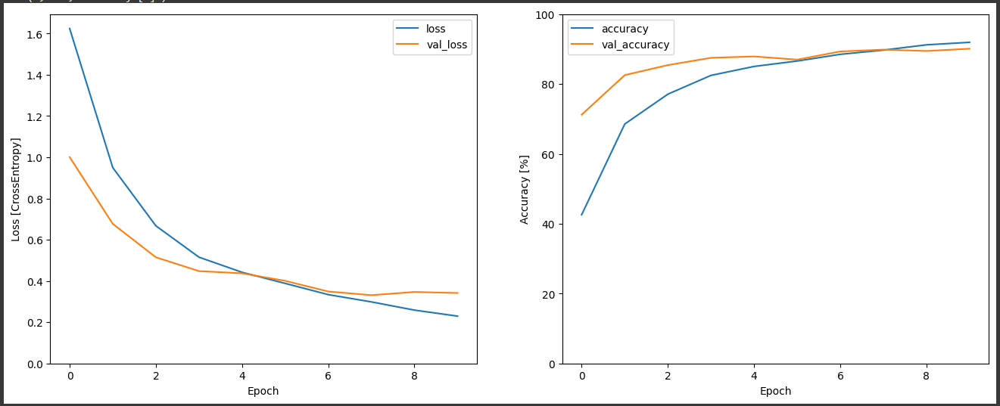

# Lab 2 - Micro Speech

Copilot assistance was crucial for part 1 and 2b C++ tasks

## Part 1: Exported model integration 
Trained a TensorFlow audio model using 49×40 spectrogram inputs (30 ms window, 20 ms stride, 16 kHz) and exported it as eric_updated.tflite. Integrated the model into the C++ micro-speech project by updating includes, ops, arena size, and build files. Verified successful inference <br/>

Changes made:
- Added new model: `models/eric_updated.tflite` (exported from Colab).
  - Generated C arrays: `models/eric_updated_model_data.cc/.h`.
  - Switched the app to include `models/eric_updated_model_data.h` and pass `g_eric_updated_model_data` to `tflite::GetModel()`.
- Build system
  - Makefile: replaced `models/micro_speech_quantized_model_data.cc` with `models/eric_updated_model_data.cc`.
- Operators
  - Registered missing ops in `micro_speech_processor.cc`: `AddConv2D`, `AddMaxPool2D`, `AddRelu`, `AddResizeBilinear`.
- Memory
  - Increased micro-speech tensor arena to 384 KB (runtime used ~318 KB).
- Shapes and types
  - Input: validated total element count and flattened [49 x 40] features into NHWC buffer.
  - Output: updated to 8 classes; `micro_model_settings.h` now has `{silence, unknown, yes, no, up, down, left, right}`.

 Modified get_spectrogram function in colab to ensure correct size:
 ```
def get_spectrogram(waveform):
    #30 ms window, 20 ms stride
    frame_length = int(0.03 * 16000)  # 480
    frame_step = int(0.02 * 16000)    # 320
    stft = tf.signal.stft(waveform, frame_length=frame_length, frame_step=frame_step)
    spectrogram = tf.abs(stft)

    #Convert to Mel scale (compress 241 -> 40 bins)
    num_mel_bins = 40
    num_spectrogram_bins = stft.shape[-1]
    linear_to_mel_weight_matrix = tf.signal.linear_to_mel_weight_matrix(
        num_mel_bins=num_mel_bins,
        num_spectrogram_bins=num_spectrogram_bins,
        sample_rate=16000,
        lower_edge_hertz=80.0,
        upper_edge_hertz=7600.0)
    mel_spectrogram = tf.tensordot(spectrogram, linear_to_mel_weight_matrix, 1)
    mel_spectrogram.set_shape(spectrogram.shape[:-1].concatenate([num_mel_bins]))

    # Add channel dimension
    mel_spectrogram = mel_spectrogram[..., tf.newaxis]
    return mel_spectrogram
```
Colab code to convert Keras file to .tflite:
```
converter = tf.lite.TFLiteConverter.from_keras_model(model)
tflite_model = converter.convert()
```
VSCode OUTPUT:
<br/>


## Part 2: Custom audio (2a/2b)
Recorded and tested custom 1 s audio clips (myyes, myno, mydown). Confirmed correct predictions in both Colab (via TFLite interpreter) and the embedded C++ mock-audio stream after converting the clips with generate.sh
### 2a:

Audio samples recorded and added to repo as: <br/>
**myyes.wav, myno.wav, mydown.wav**
<br/><br/>
Colab Output with correct prediction:
<br/>


### 2b:
VScode Output of custom data
<br/>


The model was able to successfully predict my audio files with an occasional incorrect predicition that seemed like a sample/timing issue. 
 
## Part 3: Data augmentation
Applied data augmentation (time shifts + noise) during retraining. Validation accuracy remained similar (~93–95 %) but the gap between training and validation widened, showing more overfitting.

Data augmentation code used in colab:
```
import tensorflow as tf
import tensorflow_io as tfio  #used for adding noise
import numpy as np

def add_noise(waveform, noise_factor=0.005):
    noise = tf.random.normal(shape=tf.shape(waveform), mean=0.0, stddev=noise_factor, dtype=tf.float32)
    return tf.clip_by_value(waveform + noise, -1.0, 1.0)

def time_shift(waveform, max_shift=2000):
    shift = np.random.randint(-max_shift, max_shift)
    if shift > 0:
        shifted = tf.concat([waveform[shift:], tf.zeros([shift], dtype=tf.float32)], 0)
    else:
        shifted = tf.concat([tf.zeros([-shift], dtype=tf.float32), waveform[:shift]], 0)
    return shifted

def augment_waveform(waveform):
    #Randomly apply noise and shift
    waveform = time_shift(waveform)
    waveform = add_noise(waveform)
    return waveform
```
```
 --- Test own audio samples from /content/my_audio/ ---

import tensorflow as tf
import numpy as np
import soundfile as sf
import glob
from IPython import display # Import display

#Path to folder with 1-second .wav files
audio_files = glob.glob("/content/my_audio/*.wav")
print(f"Found {len(audio_files)} audio files:", audio_files)

#Load trained TFLite model
interpreter = tf.lite.Interpreter(model_path="eric_updated.tflite")
interpreter.allocate_tensors()
input_details = interpreter.get_input_details()
output_details = interpreter.get_output_details()

#Define the spectrogram function
def get_spectrogram(waveform):
    frame_length = int(0.03 * 16000)   # 30ms window
    frame_step   = int(0.02 * 16000)   # 20ms stride
    stft = tf.signal.stft(waveform, frame_length=frame_length, frame_step=frame_step)
    spectrogram = tf.abs(stft)

    num_mel_bins = 40
    mel_weight_matrix = tf.signal.linear_to_mel_weight_matrix(
        num_mel_bins=num_mel_bins,
        num_spectrogram_bins=stft.shape[-1],
        sample_rate=16000,
        lower_edge_hertz=80.0,
        upper_edge_hertz=7600.0)

    mel_spectrogram = tf.tensordot(spectrogram, mel_weight_matrix, 1)
    mel_spectrogram.set_shape(spectrogram.shape[:-1].concatenate([num_mel_bins]))
    mel_spectrogram = mel_spectrogram[..., tf.newaxis]  # (49, 40, 1)
    return mel_spectrogram

#Match your trained labels - Use the label_names from the training part of the notebook
labels = label_names.tolist() # Convert numpy array to list

#Run inference on all audio files
for fname in audio_files:
    waveform, sr = sf.read(fname)
    if sr != 16000:
        print(f"⚠️ Skipping {fname} (sample rate {sr} Hz, expected 16000 Hz)")
        continue

    #Ensure waveform is exactly 1 second
    if len(waveform) > 16000:
        waveform = waveform[:16000]
    elif len(waveform) < 16000:
        pad = 16000 - len(waveform)
        waveform = np.pad(waveform, (0, pad))

    #Convert numpy waveform to TensorFlow tensor and add batch dimension
    waveform_tensor = tf.convert_to_tensor(waveform, dtype=tf.float32)
    spectrogram = tf.expand_dims(get_spectrogram(waveform_tensor), axis=0)

    #Run model inference
    interpreter.set_tensor(input_details[0]['index'], spectrogram)
    interpreter.invoke()
    prediction = interpreter.get_tensor(output_details[0]['index'])[0]

    print(f"\n🎤 File: {fname.split('/')[-1]}")
    print("Raw model output:", np.round(prediction, 3))

    #Get the predicted class name
    predicted_class_id = np.argmax(prediction)
    if predicted_class_id < len(labels):
        print("Predicted class:", labels[predicted_class_id])
    else:
        print(f"Predicted class ID ({predicted_class_id}) is out of range for defined labels.")

    #Play the audio
    display.display(display.Audio(waveform, rate=16000))
```
Accuracy without augmentation:
<br/>

<br/>
Accuracy with augmentation:
<br/>


Therefore it can be seen that there was a slight improvement in accuracy but the increased gap between accuracy and validation accuracy does indicate that the augmented model may be more overfit than the original.


